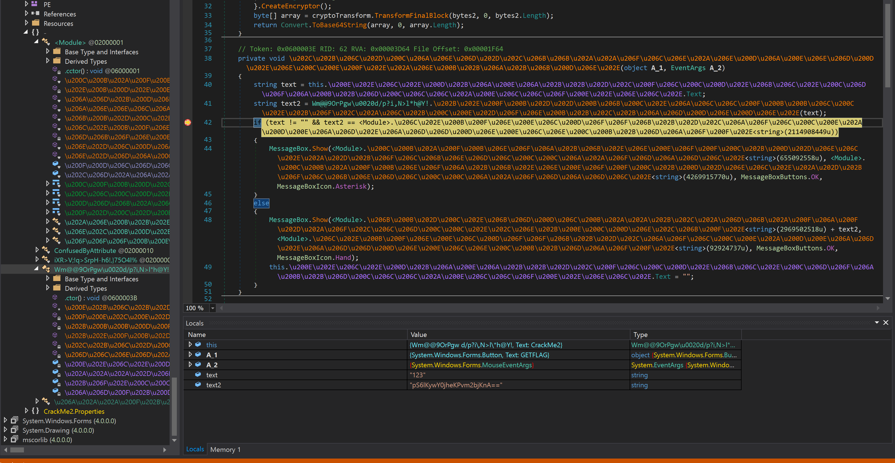
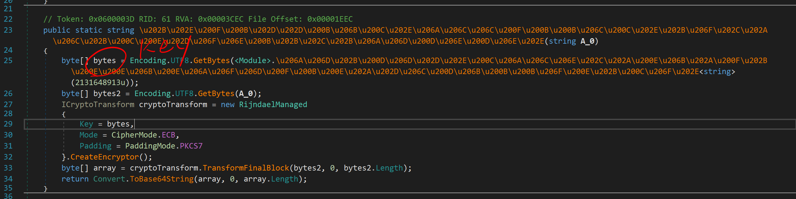

# jarvisoj.com -- REVERSE -- Classical Crackme2

## Challenge

```
做完了Classical CrackMe1是不是不太过瘾？那再来一题吧。

CrackMe2.rar.6886f4141bedfb27a2dd0d3dcc4f38f9
```

## Solution

解压还是得到一个exe程序，并且还是.Net程序。丢到 __.Net Reflector__ 里简直没法看，所以换 __dnSpy__ 查看。

关键逻辑在此：



`text2`是输入的字符串经过AES加密后的base64字符串。它应该要和一个函数返回的字符串相等。使用动态调试可以知道要匹配的字符串是：

```
x/nzolo0TTIyrEISd4AP1spCzlhSWJXeNbY81SjPgmk=
```

既然要求相等，那么对这个字符串base64解码再AES解密就应该可以得到明文。

那AES的Key在哪呢？去那个加密函数看看吧：



这个Key也可以通过在函数返回时下断点的方式的到，它是：

```
pctf2016pctf2016pctf2016pctf2016
```

所以flag就是：

```
#!/usr/bin/env python3
import base64
from Crypto.Cipher import AES

pkcs7_padding = lambda msg, block_size: msg + bytes([block_size - len(msg) % block_size]) * (block_size - len(msg) % block_size)
pkcs7_unpadding = lambda msg: msg[0:-msg[-1]]

cipher = AES.new(b'pctf2016pctf2016pctf2016pctf2016', AES.MODE_ECB)
ciphertext = base64.b64decode('x/nzolo0TTIyrEISd4AP1spCzlhSWJXeNbY81SjPgmk=')
plaintext = pkcs7_unpadding(cipher.decrypt(ciphertext))
print(plaintext.decode())
```

