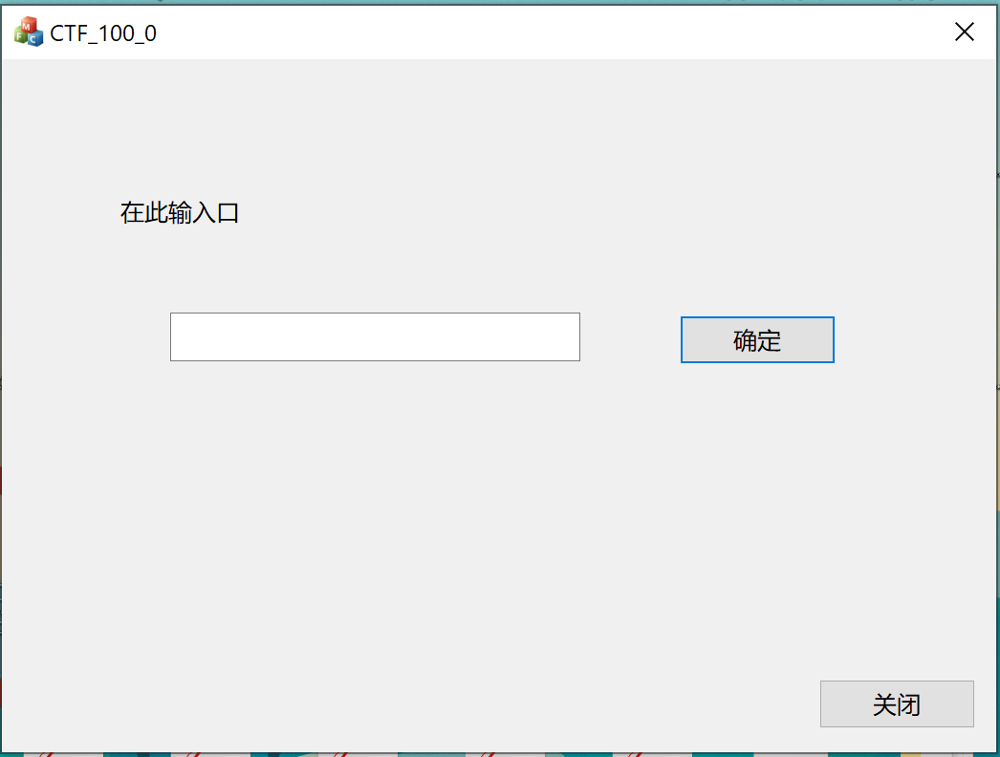

# jarvisoj.com -- REVERSE -- 软件密码破解-1

## Challenge

```
请对压缩包中的程序进行分析并获取flag。flag形式为xxx-xxxxx_xxxx。

CTF_100_0.rar.b5abee530fee7cdae2f5cdc33bb849e8
```

## Solution

附件下载下来，发现是MFC程序。好吧，丢到IDA里看看。结果大部分的函数识别不出来，看样子去除了符号表或者做了一定的混淆。

那就不妨动态调试。运行程序，得到下面的界面：



估计就是输入特定的文本，然后点击“确定”即可成功。那么不妨把重点放在`GetWindowText`上。

我们用x64dbg调试，在`GetWindowText`上设下条件断点，条件为`ReadDword(esp+4) == xxxxxxxx`，其中`xxxxxxxx`为文本框的句柄值，这个可以用VS自带的Spy++看到。

每输入一个字符就会触发断点。这个时候我们不妨对`GetWindowText`写入的缓冲区设下硬件访问断点，以追踪输入的处理过程。这个过程中，我们可以看到输入的文本在函数`sub_401D90`被复制到了一个静态区（地址`0x005779F8`）。但之后就没了下文。

好吧，看样子重点在那个“确定”按钮了。取消前面的硬件断点，给静态区`0x005779F8`下硬件访问断点，然后点“确定”。这个时候会跳转到`sub_401BB0`，读一遍函数的逻辑，发现大概就是将输入文本用某个key异或后、比较是否和几个硬编码的值相等。

既然如此，把key、密文dump出来，然后写个python脚本就可以得到flag了。

```python
#!/usr/bin/env python3

def XorBytes(a, b):
    return bytes([ i ^ j for i, j in zip(a, b) ])

ct = int(0x46171C1B).to_bytes(4, 'little') + \
     int(0x3020FDF4).to_bytes(4, 'little') + \
     int(0x7E8E0CB7).to_bytes(4, 'little') + b'\x78\xde'

key = bytes.fromhex('2857646b938f6551e353e44e1aff')

print(XorBytes(ct, key).decode())
```

